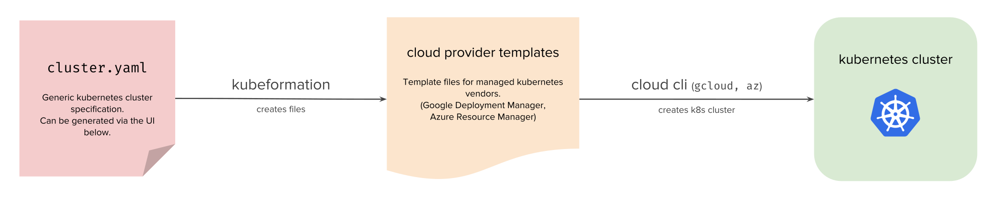

# kubeformation

Create declarative specifications for your managed Kubernetes cloud vendor (GKE, AKS).

[](https://godoc.org/github.com/hasura/kubeformation)
[](https://discord.gg/TEPDKXe)
[](https://twitter.com/intent/follow?screen_name=kubeformation)



## Motivation

With Kubernetes, it becomes possible to start making everything about your
application declarative. As cloud vendors start providing managed Kubernetes
services, provisioning a Kubernetes cluster via the vendor’s API becomes
declarative as well.

Kubeformation is a simple web UI and CLI that helps you create “Google
Deployment manager” or “Azure Resoure Manager” templates which are a _little_
painful to create by hand.

Once you have this file, you can run your cloud vendor CLI on it to provision
your cluster. You can edit this file to add vendor specific configuration too.

## Usage

- Write cluster spec. [[docs]](docs/spec/v1.md)
- Use the `kubeformation` CLI to generate template. [[docs]](docs/cli/kubeformation.md)
- Follow provider specific instructions to create the cluster. [[docs]](docs/providers/providers.md)

## Example

Here's a spec that defines a Kubernetes cluster: `cluster.yaml`

```yaml
version: v1
name: cluster-name
provider: gke
k8sVersion: "1.9"
nodePools:
- name: db-pool
  type: n1-standard-1
  size: 1
  labels:
    app: postgres
- name: backend-pool
  type: n1-standard-2
  size: 2
  labels:
    app: backend
volumes:
- name: postgres
  size: 10
```

`kubeformation` can read this file and generate [Google Cloud Deployment
Manager](https://cloud.google.com/deployment-manager/) template, which can then
be used with `gcloud` command to create the GKE cluster. This is a declarative
template that can be used to further do create or modify the cluster.

```bash
$ kubeformation -f cluster.yaml -o templates
```

Then, use `gcloud` CLI to create the deployment. [[docs]](docs/providers/gke.md)

```bash
$ gcloud deployment-manager deployments create my-cluster --config templates/gke-cluster.yaml
```

**NOTE**: `kubeformation` is exclusively meant for managed Kubernetes providers. The
following providers are currently supported:

1. Google Kubernetes Engine (GKE)
2. Azure Container Service (AKS)

## Installation

Download CLI for your platform from the [releases
page](https://github.com/hasura/kubeformation/releases), add it to `PATH` and give
execute permissions.

```bash
$ chmod +x kubeformation
```

## Docs

Read complete docs [here](docs/README.md).

## FAQ

- Why cloud provider specific information, such as zone/region/location etc.
  does not appear in the cluster spec? 
  - The purpose of Kubeformation is to bootstrap a cloud provider specific
    template that you can later modify according to your needs.

## Roadmap

Kubeformation is open to evolution. Current goal is to support all managed
Kubernetes vendors that support declarative specification.

- EKS support ([#10](https://github.com/hasura/kubeformation/issues/10))
- Other providers ([#11](https://github.com/hasura/kubeformation/issues/11))

## Contributing

Kubeformation is an open source project licensed under [Apache
2.0](https://github.com/hasura/kubeformation/blob/master/LICENSE). Checkout the
[contributing
guide](https://github.com/hasura/kubeformation/blob/master/CONTRIBUTING.md) to
get started. 

## Maintainers

Current maintainers: [@shahidh_k](https://twitter.com/shahidh_k),
[@arvishankar](https://twitter.com/arvishankar),
[@JaisonTitus](https://twitter.com/JaisonTitus). 

